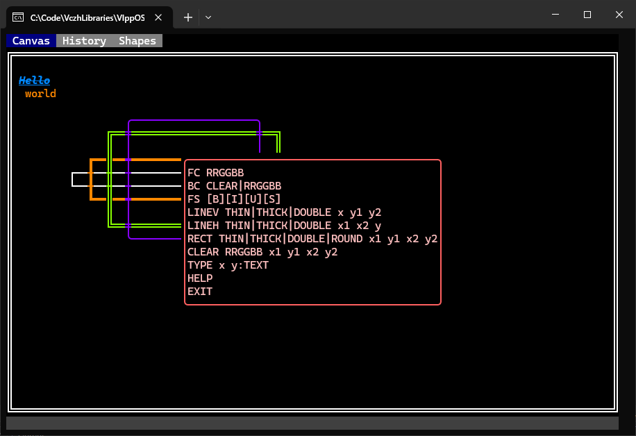
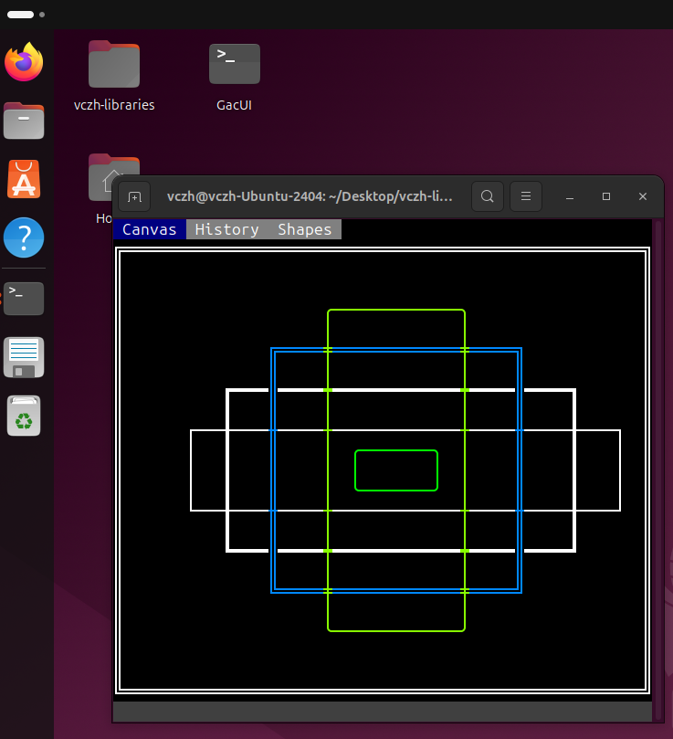
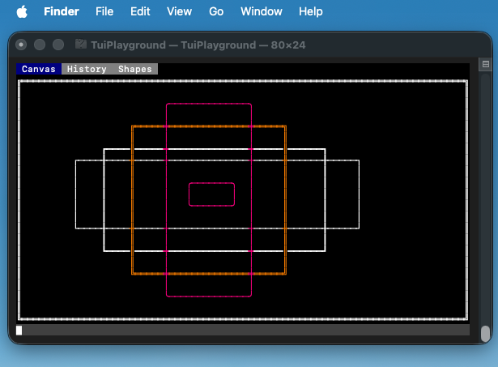

# VlppOS

**Minimum Operator System Construction.**

## License

This project is licensed under [the License repo](https://github.com/vczh-libraries/License).

Source code in this repo is for reference only, please use the source code in [the Release repo](https://github.com/vczh-libraries/Release).

You are welcome to contribute to this repo by opening pull requests.

## Document

For **Gaclib**: click [here](http://vczh-libraries.github.io/doc/current/home.html)

For **VlppOS**: click [here](http://vczh-libraries.github.io/doc/current/vlppos/home.html)

## Unit Test

Checkout [Project.md](./Project.md) for details about compiling and running each test projects.

On Windows, use MSBuild or Visual Studio to build.

On Linux/macOS, run `REPO-ROOT/.github/Ubuntu/build.sh` in a project folder to update the makefile from vcxproj and build the project.

## TUI Playground

VlppOS also comes with a simple cross-platform TUI API. It works on Windows, Linux and macOS.
It supports basic IO operations but no actual UI utilities.
It is also a renderer for `GacUI`.

